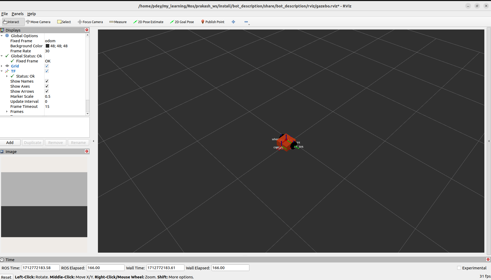

# Assignment Documentation

In this assignment i used ROS2 humble Distribution

## Q1. Documentation (bot_description)

### Launch the bot_urdf in RViz
```bash
ros2 launch bot_description rviz.launch.py
```


### Launch the bot_urdf file in Gazebo

```bash
ros2 launch bot_description spawn.launch.py
```


### Run the robot inside Empty world using Teleop twist keyboard

* Step 1. Launch the model in Gazebo
```bash
. install/setup.bash && ros2 launch bot_description spawn.launch.py
```

* Step 2. Launch controller
```bash
. install/setup.bash && ros2 launch bot_description control.launch.py
```

* Step 3. Run Teleop Twist Node
```bash
ros2 run turtlebot3_teleop teleop_keyboard
```
### Output 

[](https://github.com/Prakashdey497/ros2_custom_navigation/blob/main/prakash_ws/src/image/teleop_twist_keyboard_control.webm)


## Q2. Documentation (bot_world)

### Spawn the robot URDF in the center of the Gazebo world
```bash
. install/setup.bash && ros2 launch bot_world world.launch.py
```
### Output 


## Q3. Documentation (bot_control)

### Filter the Laser point from 0 degree to 120 degree
```bash
. install/setup.bash && ros2 run bot_control reading_laser.py
```
### Output 


## Q4. Documentation (bot_control)

### Move the robot specified multiple goal location
```bash
. install/setup.bash && ros2 run bot_control move.py
```
### Output 
[](https://github.com/Prakashdey497/ros2_custom_navigation/blob/main/prakash_ws/src/image/multiple_goal_location.webm)


